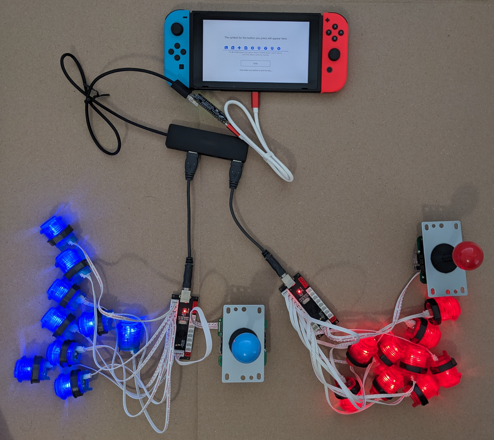
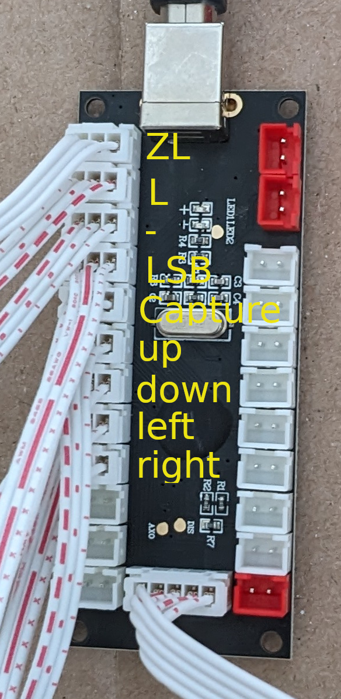
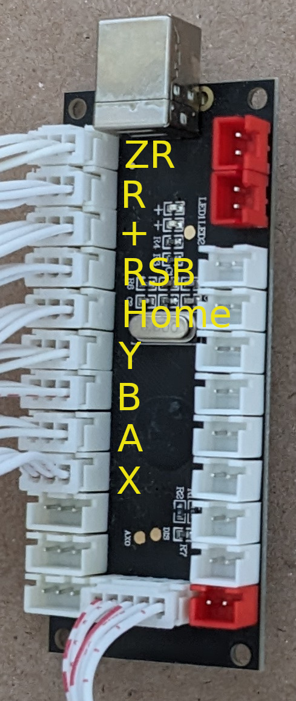

# Arcade Nintendo Switch Controller

This project creates a Nintendo Switch controller from 18 arcade buttons and 2
joysticks. No soldering is needed.

Starting from the top of the photo is the Nintendo Switch. The white USB cable
connects to the bare circuit board named the "Adafruit Feather RP2040 with USB
Type A Host". The Adafruit board provides the secret sauce to bridge the
Nintendo Switch and the two USB arcade controller boards.

The Adafruit board connects to a USB hub. The hubs connects to the USB arcade
controllers. All of the arcade buttons, joysticks, and USB controller
boards were purchased as a bundle.

The left joystick with blue buttons matches the left blue joycon. The joystick
corresponds to the small blue joycon joystick. The blue arcade buttons map to
the left side joycon buttons. Similarly for the right joystick.

## Left Side Blue Controls

Button #|Joycon button
--------|-------------
0       |Left Trigger (ZL)
1       |Left Throttle (L)
2       |Minus (-)
3       |Left stick button (LSB)
4       |Capture (square button with circle)
5       |Up (direction pad)
6       |Down (direction pad)
7       |Left (direction pad)
8       |Right (direction pad)

## Right Side Red Controls

Button #|Joycon button
--------|-------------
0       |Right Trigger (ZR)
1       |Right Throttle (R)
2       |Plus (+)
3       |Right Stick Button (RSB)
4       |Home (House icon)
5       |Y
6       |B
7       |A
8       |X

## Hardware

* 1 x Nintendo Switch with USB type C to type C cable

* 1 x Adafruit Feather RP2040 with USB Type A Host

* 1 x USB hub, unpowered

* 2 x USB cables, short

* 2 x USB arcade controller

* 9 x blue arcade buttons

* 9 x red arcade buttons

* 1 x blue joystick

* 1 x red joystick

## Easy Install

This is the best option if you do not want to change the code.

Put Adafruit board in UF2 bootloader mode. https://learn.adafruit.com/adafruit-feather-rp2040-with-usb-type-a-host/pinouts#buttons-and-rst-pin-3143253

Drag and drop switch_arcade.ino.adafruit_feather_usb_host.uf2 on to the USB
drive named RPI-RP2. Wait a few seconds for the board to finish flashing the
code. The board is ready to be used with a Nintendo Switch and arcade controls.

## Getting Started with the Arduino IDE

Highly recommended tutorial https://learn.adafruit.com/adafruit-feather-rp2040-with-usb-type-a-host
if you want to customize the software. See the section on setting up the Arduino
IDE.

This is valuable source of information for connecting analog joysticks to the
board analog inputs. Or if connecting more buttons for macros to the board
digital inputs. Some soldering required.

## Dependencies

* Arduino IDE 1.8.19 (but IDE 2.x should also work)

Install the following libraries using the IDE Library manager.

* "Adafruit TinyUSB Library"
* "Pico PIO USB"

Install the following library by downloading a zip file from github.com then
use the IDE "Add .ZIP library" option to install it.

* https://github.com/touchgadget/switch_tinyusb/

## IDE Tools options required

* Set "Board" to "Adafruit Feather RP2040 USB Host"
* Set "USB Stack" to "Adafruit TinyUSB"
* Set "CPU Speed" to 120MHz.
